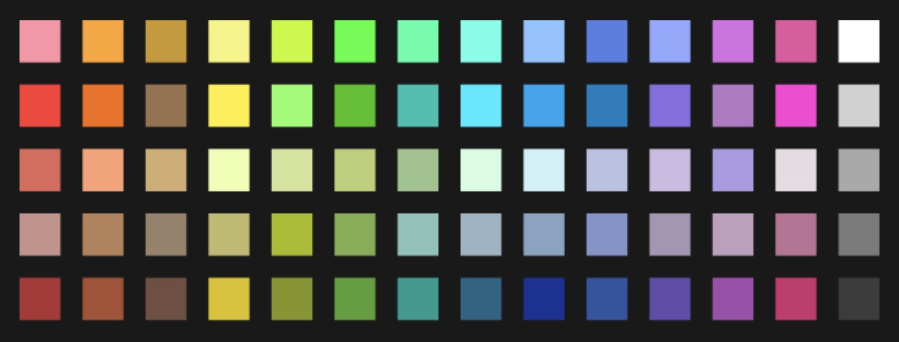
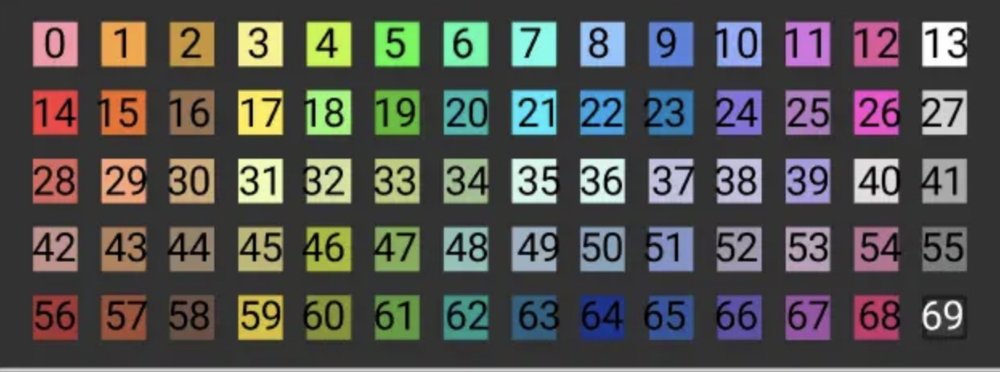

  

# AbletonAutoColor

# by Cory Boris  
### Automatic Color Assignment Based On Midi or Audio Track Name In Ableton Live WITHOUT PLUGINS ;)

\*\*for Mac or Windows (not tested on Ableton linux yet)\*\*

### 5 Steps to setup:
1. Mac users:  
   Go to `/Users/{your_username}/Music/Ableton/User Library`  
   Windows users:  
   Go to `\Users\[username]\Documents\Ableton\User Library`
2. Create a folder 'Remote Scripts' if it's not already created.
3. Create a folder titled 'ColorChanger' inside the 'Remote Scripts' folder.
4. Download both .py files ("Colorchanger.py" and "__init__.py") and place them in the 'Remote Scripts/ColorChanger' folder.
5. n Ableton, select ColorChanger in the "Link|Tempo|Midi" tab, and make sure the input and output are set to 'None'.

### Instructions for use:
Rename a Midi or Audio Track and then the color is changed instantaneously afterwards. Also colors are applied when loading a set as well. Names are not case sensitive. But, you have to use your defined spelling.

The Default color choices I wrote are as follows:

`track_colors = {
    "drums": 69,
    "bass": 14,
    "guitar": 63,
    "vocals": 13,
    "synth": 19,
    "hats": 15,
    "quarternote": 7,
    "sixteenthnote": 17,
    "openhat": 21,
    "kick": 29,
    "snare": 64
}`

To add a new color and name combo to the above structure in the code, you just have to follow the pattern of your desired track name in quotes "name" followed by a colon and then a number. As long as the last item in this dictionary (called a dictionary in python, json object in other languages) doesn't have a comma, then it should work. Note: you will have to restart ableton for any changes to be reflected in this script.   

  

If you look at the picture above, the colors start at '0' and go to '69' from top left to right. You can add as many names and colors as you want, as long as you only use numbers 0 - 69.

Only tested and working on Ableton 11, but this could work for older versions if the python script were backwards compatible for python 2.

**Future Updates:**

I'd like to make a GUI for choosing the colors you want to apply automatically. For now, with just a tiny bit of typing, you can add the colors to the dictionary in this script.

**Donations Welcome!**
- Paypal: tromboris@gmail.com
- Venmo: @Cory-Boris
- Ethereum Address: 0x3f6af994201c17eF1E86ff057AB2a2F6CB0D1f6a

Thank you! 🔥🥰✌🏻🙏🏻

**Happy Music Making,**  
-C

