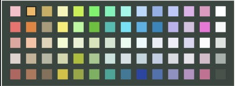

  

# AbletonAutoColor

# by Cory Boris  
### Automatic Color Assignment Based On Midi or Audio Track Name In Ableton Live

for Mac or Windows (not tested on Ableton linux yet)

### 4 Steps to setup:
1. go to /Users/{your_username}/Music/Ableton/User Library/Remote Scripts/
2. create folder titled ColorChanger
3. download files to this folder
4. select ColorChanger in Link|Tempo|Midi tab in Ableton, and make sure input and output are set to 'None'

### Instructions for use:
Rename a Midi or Audio Track and open either a new track or new device and the color is then changed afterwards. Also colors are applied when loading a set as well. Names are not case sensitive, but they must have the same letters in the same order.

Only tested on Ableton 11, but should work for any Abletons if they have python3 natively and can use control surfaces
Enjoy the python functionality native to Ableton Live which makes this possible!

### future updates:
currently, the name change event is only registered when a new track is made or a new device is opened (i.e., max for live device, instrument, but not an audio or midi effect)
this means, the color only changes when you do something as defined above. Also I would like down the road to have this work when you simply leave the renaming field or press the return or enter key.

### one (so far) runtime error:
You can ignore this if not using beta mode. If you are using ableton beta, you will see in the console that the first name change will result in a NoneType object is not callable, but that only happens the first time you name something in a newly loaded set, which I'm still trying to figure out. But this does not keep script from working. Open to any suggestions!

Donations Welcome!  
Paypal: tromboris@gmail.com  
or  
Ethereum Address: 0x3f6af994201c17eF1E86ff057AB2a2F6CB0D1f6a
thank you 🔥🥰✌🏻🙏🏻.

Happy Music Making
-C
